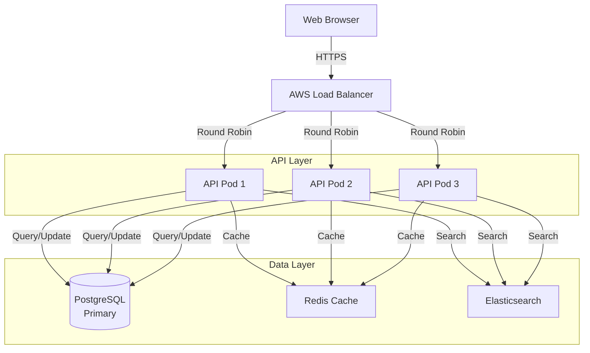

# Tool Recommendations

## Purpose

This guide recommends specific tools for common architecture, development, and operational tasks. Each recommendation includes purpose, key features, strengths/weaknesses, and integration guidance.

---

## Development Tools

### Code Editors & IDEs

#### Visual Studio Code (Recommended)
**Purpose:** Primary code editor for development  
**License:** Open Source (MIT)  
**Cost:** Free  

**Use Cases:**
- Development across multiple languages (Python, JavaScript, Go, Java)
- Git integration and version control
- Remote development and containers
- Full-featured debugging

**Key Features:**
```
✓ Lightweight yet powerful code editor
✓ Language support via extensions (200+ languages)
✓ Integrated terminal and debugging
✓ Version control integration (Git/GitHub)
✓ Remote development (SSH, containers, WSL)
✓ Live Share for collaborative coding
✓ Excellent marketplace (50,000+ extensions)
✓ Built-in task/script execution
```

**Strengths:**
- Lightweight and fast (vs IntelliJ)
- Excellent extension ecosystem
- Great for multiple language projects
- Strong team adoption and training materials
- Free and open source

**Weaknesses:**
- Requires extension configuration (more setup than IDE)
- Less intelligent refactoring than IntelliJ
- Not ideal for very large codebases (slower)

**Getting Started:**
```bash
# Install VS Code
# macOS
brew install visual-studio-code

# Recommended Extensions
- Python (Microsoft)
- Go (Google)
- Docker (Microsoft)
- Kubernetes (Microsoft)
- REST Client (Huachao Mao)
- Postman (Postman)
- Git History (Don Jayamanne)
```

**Integration:**
- GitHub: Native integration with authentication
- Docker/Kubernetes: Container development directly in VS Code
- Debugging: Built-in debuggers for major languages
- Testing: Extension support for test runners

---

#### IntelliJ IDEA (JetBrains)
**Purpose:** Full-featured IDE for Java/JVM development  
**License:** Proprietary (community edition free, professional $199/year)  
**Cost:** Free (Community) or $199/year (Professional)  

**Use Cases:**
- Java/Kotlin development (primary use case)
- Large codebases with complex refactoring
- Enterprise development with sophisticated features
- Android development (with plugin)

**Key Features:**
```
✓ Intelligent code completion (beyond syntax)
✓ Powerful refactoring capabilities
✓ Built-in inspections and quick fixes
✓ Excellent debugging and profiling tools
✓ Maven/Gradle integration
✓ Spring Boot support and run configurations
✓ Database tools and SQL support
✓ Team collaboration features
```

**Strengths:**
- Best-in-class refactoring for Java
- Intelligent code analysis
- Excellent Spring/Spring Boot support
- Great for large enterprise projects
- Strong performance optimization

**Weaknesses:**
- Expensive for teams ($199/person/year)
- Heavy resource usage (memory hungry)
- Overkill for simple projects
- Steeper learning curve than VS Code

**Getting Started:**
```bash
# Install IntelliJ IDEA Community Edition
brew install intellij-idea-ce

# Configuration
1. Open IntelliJ
2. Install plugins: Kubernetes, Docker, Protocol Buffers
3. Configure JDK in Project Structure
4. Set code style preferences
```

---

#### PyCharm (JetBrains)
**Purpose:** Specialized IDE for Python development  
**License:** Proprietary (community edition free, professional $199/year)  
**Cost:** Free (Community) or $199/year (Professional)  

**Use Cases:**
- Python development and data science
- Django/Flask web development
- Rapid Python development with intelligent features

**Strengths:**
- Best Python IDE available
- Excellent virtual environment management
- Great Jupyter notebook support
- Django and Flask debugging support

**Weaknesses:**
- Expensive for large teams
- Overkill for simple scripts
- VS Code often sufficient for Python

**Recommendation:** Use VS Code with Python extension for most cases; PyCharm for teams doing heavy Python development.

---

### API Development Tools

#### Postman
**Purpose:** API development, testing, and documentation  
**License:** Proprietary (free tier available)  
**Cost:** Free (basic) or $180/year/user (professional)  

**Use Cases:**
- API testing and debugging
- Request collection and documentation
- Test automation and CI/CD integration
- API contract testing

**Key Features:**
```
✓ Request building with full HTTP support
✓ Collection organization and sharing
✓ Pre-request scripts and post-response tests
✓ Environment variables for different environments
✓ Mock servers for API prototyping
✓ API monitoring and health checks
✓ Team collaboration and versioning
✓ CI/CD pipeline integration
```

**Installation:**
```bash
# macOS
brew install postman

# Creating an API test collection
1. Launch Postman
2. Create new collection "E-Commerce API"
3. Add requests:
   - GET /products (with parameters)
   - POST /orders (with request body)
   - PUT /orders/{id} (with variable substitution)
   - DELETE /orders/{id}
4. Configure pre-request scripts for auth tokens
5. Add tests to verify responses
6. Share collection with team
```

**Integration:**
- GitHub: Version collections in Git
- CI/CD: Run collections in GitHub Actions/Jenkins
- APIs: OpenAPI import/export
- Monitoring: Scheduled collection runs

---

#### Insomnia
**Purpose:** Lightweight REST API client alternative to Postman  
**License:** Open Source (with Kong Cloud option)  
**Cost:** Free  

**Use Cases:**
- Simple API testing (lighter than Postman)
- GraphQL testing
- REST API development and debugging

**Strengths:**
- Lightweight and fast (less resource intensive)
- Open source core
- Great GraphQL support
- Simpler UI than Postman

**Weaknesses:**
- Smaller ecosystem than Postman
- Limited mock server capabilities
- Fewer collaborative features

**Recommendation:** Good for individual developers; Postman for teams needing advanced features.

---

## Architecture & Design Tools

### Diagramming Tools

#### Mermaid (Recommended for architects)
**Purpose:** Text-based diagram creation (ASCII art alternative)  
**License:** Open Source (MIT)  
**Cost:** Free  

**Use Cases:**
- Architecture diagrams in documentation
- Sequence diagrams for flows
- Flowcharts for processes
- Entity relationship diagrams

**Advantages:**
- Version control friendly (plain text)
- Simple syntax (easy to learn)
- Integrates with Markdown and docs
- Free and open source
- Great for documentation

**Example Architecture Diagram:**


**Getting Started:**
```bash
# Install Mermaid CLI
npm install -g @mermaid-js/mermaid-cli

# Create diagram in Markdown
# File: architecture.md
\`\`\`mermaid
graph TB
    A[Start] --> B{Decision}
    B -->|Yes| C[Process A]
    B -->|No| D[Process B]
    C --> E[End]
    D --> E
\`\`\`

# Export to image
mmdc -i architecture.md -o architecture.png
```

---

#### draw.io (Recommended for complex diagrams)
**Purpose:** Free, comprehensive diagramming tool  
**License:** Open Source (Apache 2.0)  
**Cost:** Free (web and desktop)  

**Use Cases:**
- Complex architecture diagrams with rich shapes
- C4 model diagrams
- Detailed system design drawings
- Network topology diagrams

**Key Features:**
```
✓ Drag-and-drop shape library (1000+ shapes)
✓ Cloud storage integration (Google Drive, OneDrive)
✓ Multiple export formats (PNG, SVG, PDF)
✓ Real-time collaboration
✓ Plugin support
✓ C4 model shape library
✓ Desktop and web versions
```

**Getting Started:**
```bash
# Option 1: Web version (no installation)
# Visit: https://app.diagrams.net

# Option 2: Desktop version (macOS)
brew install drawio

# Using draw.io for C4 diagrams:
1. Open draw.io
2. File → New → C4 Diagram
3. Drag C4 components (System, Container, Component, Code)
4. Draw relationships between components
5. Export as PNG/SVG for documentation
```

---

#### Lucidchart
**Purpose:** Professional collaborative diagramming platform  
**License:** Proprietary  
**Cost:** $89/year (personal) to $252/year (team)  

**Use Cases:**
- Team diagramming with real-time collaboration
- Professional presentations
- Complex system design with rich templates

**Strengths:**
- Excellent collaboration features
- Professional appearance
- Large shape library
- Integration with Office/Google products

**Weaknesses:**
- Subscription required
- Not ideal for version control (binary format)
- Overkill for simple diagrams

**Recommendation:** Use for large team diagrams; use Mermaid/draw.io for documentation.

---

## Infrastructure & DevOps Tools

### Infrastructure as Code

#### Terraform (Recommended)
**Purpose:** Infrastructure as Code tool for AWS, Azure, GCP  
**License:** Open Source (MPL 2.0)  
**Cost:** Free (Community); $200/month minimum (Terraform Cloud)  

**Use Cases:**
- Define infrastructure declaratively
- Multi-cloud IaC (AWS, Azure, GCP)
- Reproducible infrastructure
- Infrastructure versioning and change tracking

**Key Features:**
```
✓ Declarative configuration language (HCL)
✓ Multi-cloud support (AWS, Azure, GCP, etc.)
✓ State management and remote storage
✓ Plan/apply workflow (dry-run before changes)
✓ Module system for code reuse
✓ Comprehensive provider ecosystem
✓ Workspace isolation for environments
```

**Installation:**
```bash
# macOS
brew install terraform

# Basic Terraform structure
infrastructure/
├── main.tf              # Main configuration
├── variables.tf         # Input variables
├── outputs.tf           # Output values
├── terraform.tfvars     # Variable values
└── modules/
    ├── networking/
    │   ├── main.tf
    │   ├── variables.tf
    │   └── outputs.tf
    └── databases/
        ├── main.tf
        ├── variables.tf
        └── outputs.tf

# Example: Create AWS RDS instance
provider "aws" {
  region = "us-east-1"
}

resource "aws_db_instance" "postgres" {
  identifier          = "production-postgres"
  engine              = "postgres"
  engine_version      = "15.2"
  instance_class      = "db.t3.medium"
  allocated_storage   = 100
  storage_type        = "gp3"
  
  db_name  = "production"
  username = "postgres"
  password = var.db_password
  
  backup_retention_period = 30
  skip_final_snapshot    = false
  final_snapshot_identifier = "postgres-final-snapshot"
  
  vpc_security_group_ids = [aws_security_group.postgres.id]
  db_subnet_group_name   = aws_db_subnet_group.postgres.name
}

# Workflow
terraform plan      # Preview changes
terraform apply     # Apply changes
terraform destroy   # Cleanup resources
```

**Best Practices:**
```
✓ Store state in remote backend (S3 with locking)
✓ Use terraform.tfvars for sensitive values (in .gitignore)
✓ Organize modules by component (database, networking, etc.)
✓ Use variable validation for safety
✓ Tag all resources for cost tracking
✓ Use workspaces for environment separation
✓ Version providers and modules
✓ Plan before apply (always review terraform plan output)
```

---

#### AWS CloudFormation
**Purpose:** AWS native Infrastructure as Code  
**License:** Proprietary (AWS service)  
**Cost:** Free (pay only for created resources)  

**Use Cases:**
- AWS-specific infrastructure as code
- AWS ecosystem integration
- Teams already in AWS ecosystem

**Comparison to Terraform:**
- Advantage: Native AWS integration, strong parameter validation
- Disadvantage: AWS-only (not multi-cloud), JSON/YAML syntax, no dry-run

**Recommendation:** Use Terraform for multi-cloud or portable IaC; CloudFormation if AWS-only.

---

### CI/CD Platforms

#### GitHub Actions (Recommended)
**Purpose:** Built-in CI/CD for GitHub repositories  
**License:** Proprietary (GitHub)  
**Cost:** Free (public repos, 2000 min/month private); $0.008/minute (private overages)  

**Use Cases:**
- Build and test on every push
- Deploy to cloud platforms
- Automated testing and quality checks
- Release automation

**Key Features:**
```
✓ Native GitHub integration
✓ Workflow automation with YAML
✓ Matrix testing (test across versions/OS)
✓ Secrets management
✓ Artifact storage
✓ Scheduled workflows
✓ Manual workflow triggers
✓ Marketplace with 10,000+ actions
```

**Example Workflow - Python Application:**
```yaml
name: Build and Deploy

on:
  push:
    branches: [main, develop]
  pull_request:
    branches: [main]

jobs:
  test:
    runs-on: ubuntu-latest
    strategy:
      matrix:
        python-version: ['3.10', '3.11', '3.12']
    
    steps:
    - uses: actions/checkout@v4
    
    - name: Set up Python
      uses: actions/setup-python@v4
      with:
        python-version: ${{ matrix.python-version }}
    
    - name: Cache pip packages
      uses: actions/cache@v3
      with:
        path: ~/.cache/pip
        key: ${{ runner.os }}-pip-${{ hashFiles('requirements.txt') }}
    
    - name: Install dependencies
      run: |
        pip install -r requirements.txt
        pip install pytest pytest-cov
    
    - name: Lint with flake8
      run: flake8 src/ --count --select=E9,F63,F7,F82 --show-source
    
    - name: Test with pytest
      run: pytest --cov=src tests/ --cov-report=xml
    
    - name: Upload coverage to Codecov
      uses: codecov/codecov-action@v3
      with:
        files: ./coverage.xml

  deploy:
    needs: test
    runs-on: ubuntu-latest
    if: github.ref == 'refs/heads/main' && github.event_name == 'push'
    
    steps:
    - uses: actions/checkout@v4
    
    - name: Deploy to Production
      env:
        DEPLOY_KEY: ${{ secrets.DEPLOY_KEY }}
      run: |
        chmod 600 $HOME/.ssh/deploy_key
        ./scripts/deploy.sh
```

**Getting Started:**
```bash
# 1. Create .github/workflows/ci.yml in repository
# 2. Commit and push
# 3. Monitor runs in GitHub Actions tab
# 4. Check logs for any failures

# Example structure:
.github/
└── workflows/
    ├── build-and-test.yml
    ├── deploy-staging.yml
    └── deploy-production.yml
```

**Integration:**
- Code coverage: Codecov, Coveralls
- Security scanning: Snyk, OWASP ZAP
- Container registry: Docker Hub, ECR
- Cloud deployment: AWS, Azure, GCP
- Notifications: Slack, Teams, email

---

#### GitLab CI
**Purpose:** GitLab's native CI/CD  
**License:** Open Source (CE) or Proprietary (SaaS/EE)  
**Cost:** Free (SaaS GitLab.com)  

**Comparison to GitHub Actions:**
- Advantage: Excellent local testing, runner flexibility
- Disadvantage: Slightly more complex for simple use cases

**Recommendation:** Use GitHub Actions if already on GitHub; GitLab CI if on GitLab.

---

### Container Orchestration

#### Kubernetes (EKS on AWS)
**Purpose:** Container orchestration and management platform  
**License:** Open Source (Apache 2.0)  
**Cost:** AWS EKS $73/month + compute resources  

**Use Cases:**
- Production container orchestration
- Auto-scaling applications based on load
- Rolling deployments and updates
- Service discovery and load balancing

**Architecture:**
```
Kubernetes Cluster (EKS)
├── Control Plane (AWS managed)
│   ├── API Server
│   ├── Scheduler
│   ├── Controller Manager
│   └── etcd
│
└── Worker Nodes (EC2 instances)
    ├── Node Group 1 (general purpose)
    ├── Node Group 2 (compute optimized)
    └── Node Group 3 (memory optimized)

Cluster Add-ons:
├── CoreDNS (service discovery)
├── Prometheus/Grafana (monitoring)
├── AWS ALB Ingress Controller
└── Fluentd/Elasticsearch (logging)
```

**Getting Started:**
```bash
# Install kubectl
brew install kubectl

# Install AWS CLI and eksctl
brew install awscli eksctl

# Create EKS cluster
eksctl create cluster \
  --name production \
  --region us-east-1 \
  --nodegroup-name standard-workers \
  --node-type t3.medium \
  --nodes 3 \
  --nodes-max 10

# Deploy application
kubectl apply -f deployment.yaml
kubectl get pods
kubectl logs pod-name

# Example: Deploy Python microservice
apiVersion: apps/v1
kind: Deployment
metadata:
  name: api-service
spec:
  replicas: 3
  selector:
    matchLabels:
      app: api-service
  template:
    metadata:
      labels:
        app: api-service
    spec:
      containers:
      - name: api
        image: my-registry/api:latest
        ports:
        - containerPort: 8000
        env:
        - name: DATABASE_URL
          valueFrom:
            secretKeyRef:
              name: db-secrets
              key: connection-string
        resources:
          requests:
            cpu: 100m
            memory: 128Mi
          limits:
            cpu: 500m
            memory: 512Mi
        livenessProbe:
          httpGet:
            path: /health
            port: 8000
          initialDelaySeconds: 10
          periodSeconds: 10
```

---

#### Helm (Kubernetes Package Manager)
**Purpose:** Package manager for Kubernetes applications  
**License:** Open Source (Apache 2.0)  
**Cost:** Free  

**Use Cases:**
- Package and distribute Kubernetes applications
- Template Kubernetes manifests
- Complex deployments with variables
- Release management and rollbacks

**Example:**
```bash
# Install Helm chart for PostgreSQL
helm repo add bitnami https://charts.bitnami.com/bitnami
helm install postgres bitnami/postgresql \
  --values values.yaml

# values.yaml
global:
  postgresql:
    auth:
      username: postgres
      password: securepassword
      database: production

primary:
  persistence:
    size: 100Gi
  resources:
    requests:
      cpu: 500m
      memory: 1Gi
```

---

## Monitoring & Observability

### Metrics Collection & Visualization

#### Prometheus + Grafana Stack (Recommended)
**Purpose:** Metrics collection, storage, and visualization  
**License:** Open Source (Apache 2.0)  
**Cost:** Free  

**Components:**
```
Prometheus:
- Time-series metrics database
- Scrapes metrics from applications
- Powerful query language (PromQL)
- Alert rule evaluation

Grafana:
- Dashboard and visualization platform
- Connects to Prometheus (and other datasources)
- Alert management
- User/team access control
```

**Architecture:**
```
Applications
  ↓ (metrics on /metrics endpoint)
Prometheus (scrapes every 15s)
  ↓ (stores time-series data)
Time-series Database
  ↓ (queries)
Grafana Dashboards
  ↓ (visualizes)
Web Browser
```

**Installation & Setup:**
```bash
# Docker Compose setup
version: '3.9'

services:
  prometheus:
    image: prom/prometheus:latest
    volumes:
      - ./prometheus.yml:/etc/prometheus/prometheus.yml
      - prometheus-storage:/prometheus
    ports:
      - "9090:9090"
    command:
      - '--config.file=/etc/prometheus/prometheus.yml'
      - '--storage.tsdb.path=/prometheus'

  grafana:
    image: grafana/grafana:latest
    ports:
      - "3000:3000"
    environment:
      - GF_SECURITY_ADMIN_PASSWORD=admin
    volumes:
      - grafana-storage:/var/lib/grafana

volumes:
  prometheus-storage:
  grafana-storage:

# Run
docker-compose up -d
# Prometheus: localhost:9090
# Grafana: localhost:3000 (admin/admin)
```

**Useful Metrics:**
```
Application Metrics:
- request_duration_seconds (histogram)
- http_requests_total (counter)
- active_connections (gauge)
- cache_hit_ratio (gauge)
- database_query_duration_seconds (histogram)
- queue_length (gauge)

Infrastructure Metrics:
- node_cpu_seconds_total (CPU usage)
- node_memory_bytes (memory usage)
- node_disk_bytes_total (disk space)
- container_cpu_usage_seconds_total (container CPU)
- container_memory_usage_bytes (container memory)
```

---

#### Datadog
**Purpose:** Comprehensive observability platform  
**License:** Proprietary (SaaS)  
**Cost:** $15-45+ per host per month  

**Use Cases:**
- Enterprise observability (metrics, logs, traces, APM)
- Complex distributed systems monitoring
- Compliance and security monitoring
- Teams needing support and professional services

**Key Features:**
```
✓ Unified platform (metrics, logs, traces, APM)
✓ AI-powered anomaly detection
✓ Service dependency mapping
✓ Infrastructure monitoring
✓ Application performance monitoring (APM)
✓ Alerting and incident management
✓ Integration with 400+ tools
✓ Professional support and SLAs
```

---

## Testing Tools

### Load Testing

#### k6 (Recommended for team use)
**Purpose:** Modern load testing platform  
**License:** Open Source (AGPL) / SaaS  
**Cost:** Free (open source) or $199+/month (cloud)  

**Use Cases:**
- API load testing
- Performance testing
- Spike and stress testing
- Threshold validation testing

**Example:**
```javascript
import http from 'k6/http';
import { check, group } from 'k6';
import { Rate } from 'k6/metrics';

export const options = {
  stages: [
    { duration: '2m', target: 100 },   // Ramp-up
    { duration: '5m', target: 100 },   // Stay at 100
    { duration: '2m', target: 0 },     // Ramp-down
  ],
  thresholds: {
    http_req_duration: ['p(95)<500', 'p(99)<1000'],
    http_req_failed: ['rate<0.1'],
  },
};

const errorRate = new Rate('errors');

export default function () {
  group('API - Product Search', () => {
    const res = http.get(
      'https://api.example.com/products?q=laptop&limit=10',
      {
        headers: {
          'Authorization': `Bearer ${__ENV.API_TOKEN}`,
        },
      }
    );
    
    check(res, {
      'status is 200': (r) => r.status === 200,
      'response time < 500ms': (r) => r.timings.duration < 500,
      'has products': (r) => r.json('data.length') > 0,
    }) || errorRate.add(1);
  });
}
```

**Run test:**
```bash
# Install k6
brew install k6

# Run load test
k6 run load-test.js

# Run with custom parameters
k6 run -e API_TOKEN=token123 load-test.js

# Cloud execution
k6 cloud load-test.js
```

---

### Security Testing

#### OWASP ZAP
**Purpose:** Security vulnerability scanner for web applications  
**License:** Open Source (Apache 2.0)  
**Cost:** Free  

**Use Cases:**
- Automated security scanning
- OWASP Top 10 vulnerability detection
- API security testing
- CI/CD integration

---

#### Snyk
**Purpose:** Dependency vulnerability scanning and remediation  
**License:** Proprietary (free tier available)  
**Cost:** Free or $25-200/month  

**Use Cases:**
- Scan dependencies for known vulnerabilities
- CI/CD integration
- Container image scanning
- License compliance checking

**Integration:**
```bash
# Install Snyk CLI
npm install -g snyk

# Test dependencies
snyk test

# Monitor for vulnerabilities
snyk monitor

# Fix vulnerabilities
snyk fix
```

---

## Documentation & Collaboration

### Documentation Platforms

#### MkDocs (Recommended for architects)
**Purpose:** Static documentation site builder  
**License:** Open Source (BSD)  
**Cost:** Free  

**Use Cases:**
- Architecture documentation
- Runbooks and operational guides
- Knowledge base
- API documentation

**Setup:**
```bash
# Install MkDocs
pip install mkdocs

# Create project
mkdocs new my-docs
cd my-docs

# Structure
my-docs/
├── mkdocs.yml
├── docs/
│   ├── index.md
│   ├── architecture/
│   │   ├── principles.md
│   │   └── patterns.md
│   └── operations/
│       ├── runbooks.md
│       └── alerts.md
└── requirements.txt

# mkdocs.yml
site_name: Architecture Documentation
theme:
  name: material
  features:
    - navigation.tabs
    - search.suggest

plugins:
  - search
  - minify

# Run locally
mkdocs serve
# Visit: http://localhost:8000

# Deploy to GitHub Pages
mkdocs gh-deploy
```

**Advantages:**
- Version control friendly (Markdown)
- Simple and fast
- Easy to host (GitHub Pages, etc.)
- Great for technical documentation

---

## Related Resources

- [Technology Radar](./technology-radar.md)
- [Technology Selection Guide](./technology-selection.md)
- [Performance Guide](../playbooks/performance-guide.md)
- [Security Guide](../playbooks/security-guide.md)

---

**Status:** Complete  
**Last Updated:** November 2025  
**Version:** 1.0  
**Contributors:** Architecture Practice Team
